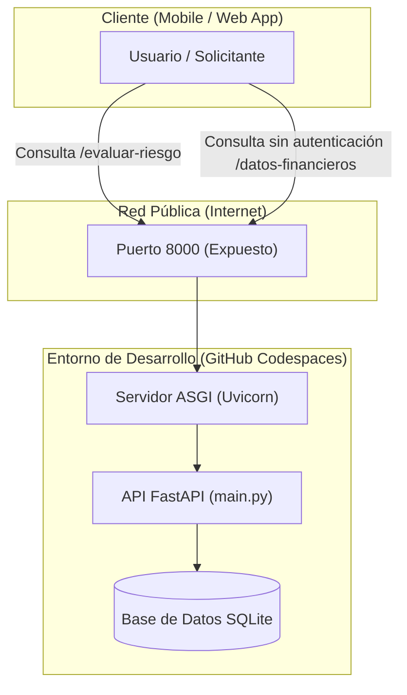
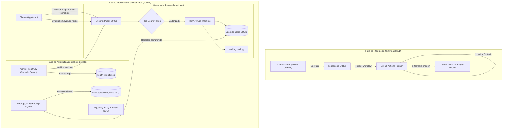

# FinTech Nova — Sistema Integrador de Evaluación de Riesgo

Bienvenido al repositorio oficial del proyecto final de **FinTech Nova**. Este sistema comprende un motor de evaluación crediticia desarrollado en **FastAPI**, securizado con filtros de control de acceso, empaquetado en contenedores **Docker**, monitoreado de manera autónoma y automatizado mediante integración continua con **GitHub Actions**.

---

## 👥 Integrantes del Proyecto (Grupo de Trabajo)
* **Integrante 1**: Juan David Mendez Mejia
* **Integrante 2**: Luis Esteban Vargas Pelayo
* **Integrante 3**: Keiner Sebastian Penagos Villalobos 

---

## 🏛️ 1. Diagramas de Arquitectura

### 🔸 Arquitectura Base / Inicial ("As-Is") — Fase 1
Muestra el estado inicial donde la API corre de forma manual en una máquina virtual de desarrollo (GitHub Codespaces) exponiendo un endpoint de datos financieros sensible públicamente sin control de autenticación.



---

### 🔹 Arquitectura Final Con Hardening y CI/CD ("To-Be") — Fase 4
Detalla la arquitectura de producción protegida mediante una capa de seguridad (HTTP Bearer Token), empaquetada en un contenedor Docker con usuario no-root, monitoreada por scripts automatizados y compilada mediante un pipeline de GitHub Actions en cada cambio de código.



---

## 🔒 2. Seguridad y Hardening (Laboratorio 2)
Se identificó que el endpoint `/datos-financieros/{id_cliente}` exponía transacciones e información sensible sin autorización. 
* **Acción Tomada**: Se implementó una capa de validación en [main.py](file:///c:/Users/Usuario/Downloads/códigos completos/main.py) usando el esquema `HTTPBearer` de FastAPI.
* **Control**: Peticiones no autenticadas o con token inválido devuelven `401 Unauthorized`. 
* **Endpoints Protegidos**: 
  * `/datos-financieros/{id_cliente}`
  * `/datos-sensibles`
  * `/datos-sensibles/{id_cliente}`
* **Token de Acceso Definido**: `FinTechNovaSecureToken2026`
* *Ver reporte completo de auditoría y pruebas en [auditoria_seguridad.md](file:///c:/Users/Usuario/Downloads/códigos completos/auditoria_seguridad.md).*

---

## 🐳 3. Contenerización y Scripts de Automatización (Laboratorio 3)

### Empaquetado Docker
La aplicación cuenta con un [Dockerfile](file:///c:/Users/Usuario/Downloads/códigos completos/Dockerfile) optimizado basado en la imagen ligera oficial **`python:3.9-slim`**. El contenedor está configurado bajo el **Principio de Mínimo Privilegio**, creando y ejecutando la API como un usuario no-root (`appuser`), aislando el entorno de producción.

Para construir y levantar el contenedor manualmente:
```bash
# Construir la imagen
docker build -t fintech-nova:latest .

# Ejecutar el contenedor mapeando el puerto 8000
docker run -d -p 8000:8000 --name fintech-api fintech-nova:latest
```

También se dispone de **`docker-compose`** para inicializar los servicios:
```bash
docker-compose up -d
```

### Script de Monitoreo Autónomo (`monitor_health.py`)
Se desarrolló [monitor_health.py](file:///c:/Users/Usuario/Downloads/códigos completos/monitor_health.py) para evaluar el estado operacional consultando el endpoint administrativo `/status`. Registra en el archivo local `health_monitor.log` cada verificación.

```bash
# Ejecutar el monitoreo autónomo (verificando cada 10 segundos por defecto)
python monitor_health.py
```

### Script de Respaldo de Base de Datos (`backup_db.py`)
Genera archivos de respaldo comprimidos `.tar.gz` de la base de datos `database.db` en el directorio `backups/`, aplicando una regla de retención automática de los últimos 7 días.
```bash
python backup_db.py
```

### Detector de Intrusos de Inyección SQL (`log_analyzer.py`)
Verifica patrones de firmas sospechosas de SQL Injection en los archivos de log de peticiones (como `server.log`) y genera reportes estadísticos estructurados.
```bash
python log_analyzer.py server.log
```

---

## 🤖 4. Pipeline de CI/CD (Laboratorio 4)
Ubicado en [.github/workflows/ci-cd.yml](file:///c:/Users/Usuario/Downloads/códigos completos/.github/workflows/ci-cd.yml), este flujo de trabajo se dispara en GitHub Actions con cada `push` o `pull_request` sobre las ramas `main` y `master`.
* **Fases del Pipeline**:
  1. Configuración del entorno con Python 3.9.
  2. Instalación y actualización de dependencias de `requirements.txt`.
  3. Comprobación estática de compilación de código (`py_compile`).
  4. Construcción de la imagen de Docker para validar la receta de despliegue antes de producción.

---

## 🛠️ 5. Guía de Ejecución Local y Desarrollo (Windows/Multiplataforma)

### Paso 1: Configurar el Entorno Virtual
```powershell
python -m venv venv
.\venv\Scripts\Activate.ps1
```

### Paso 2: Instalar Dependencias
```bash
pip install -r requirements.txt
```

### Paso 3: Arrancar el Servidor
```bash
uvicorn main:app --reload --host 127.0.0.1 --port 8000
```
* **Docs de Swagger**: http://127.0.0.1:8000/docs
* **Endpoint de Salud General**: http://127.0.0.1:8000/health
* **Endpoint de Estado**: http://127.0.0.1:8000/status
